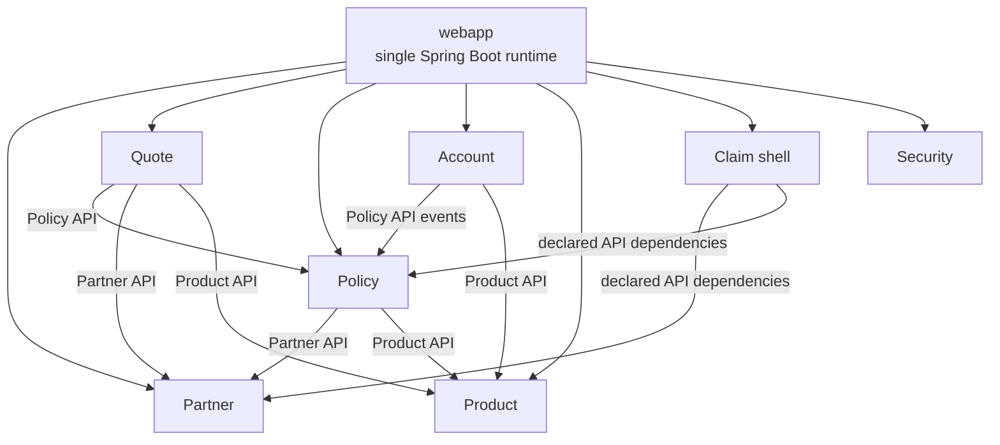
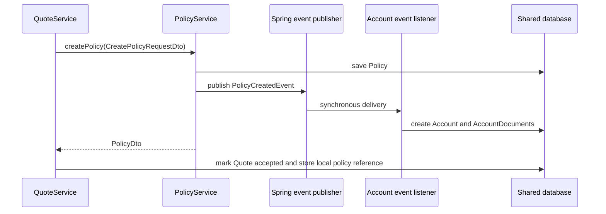

# Architecture — Current System

This documentation describes the architecture currently implemented in `jmix-insurance`. It is a
map for developers and coding agents: where responsibilities live, which dependencies exist, how
the main runtime flows work, and which checks protect the structure.

It deliberately does not reconstruct the decision process. Alternatives, drivers, and accepted
trade-offs are recorded in the [Architecture Decision Records](adr/README.md). Task-specific
implementation procedures live in the repository's [skills](../.skills).

**Last verified against the source tree:** 2026-08-08

## Documentation Map

| Document | Use it when changing |
|---|---|
| [Modules and boundaries](architecture/modules-and-boundaries.md) | Gradle builds, dependencies, API/Core/UI placement, starters, packages |
| [Domain model and runtime flows](architecture/domain-model-and-flows.md) | Entities, DTOs, services, events, local references, transactions |
| [UI architecture](architecture/ui-architecture.md) | Views, descriptors, consumer-owned UI, fragments, cross-module UI sections |
| [Persistence and security](architecture/persistence-and-security.md) | Liquibase, tables, entity names, resource roles, application personas |
| [Testing strategy](architecture/testing-strategy.md) | Test scope, fixtures, cleanup, assertions, UI test infrastructure |
| [Automated guardrails](architecture/automated-guardrails.md) | Architecture tests, static analysis, validation commands, CI feedback |

Read this overview first for broad changes, then load only the topic documents relevant to the
task. The source code remains authoritative when a document and implementation disagree.

## System at a Glance

`jmix-insurance` is a modular monolith built with Jmix 2, Spring Boot 3, Vaadin 24, EclipseLink
JPA, Java 21, Liquibase, and Gradle composite builds.

- One Spring Boot process is started from `webapp`.
- One embedded HSQLDB database and one Jmix transaction manager serve all installed modules.
- Business capabilities are packaged as independently publishable Jmix add-ons.
- Each bounded context owns its API, implementation, persistence model, UI, migrations, and
  fine-grained security policies.
- The `webapp` is the composition root for starters, the master changelog, application roles, the
  main view, and login.
- Cross-domain Java access uses API contracts and Jmix DTO entities, never foreign Core entities.
- Cross-domain persistent references are consumer-owned `@Embeddable` value objects without
  foreign JPA associations.

Arrows between domains indicate allowed API-level dependencies, not JPA relationships or
separate network calls.

## Bounded Contexts

| Context | Current responsibility | Persistent model | Public contracts |
|---|---|---|---|
| Partner | Partner master data and lookup | `Partner` | `PartnerService`, `PartnerDto` |
| Product | Shared product vocabulary and premium rules | None | Product and payment enums |
| Quote | Offer capture, premium calculation, acceptance and rejection | `Quote` | `QuoteService`, `QuoteDto` |
| Policy | Active insurance contracts and partner-policy summaries | `Policy` | `PolicyService`, `PolicyCreatedEvent`, policy DTOs |
| Account | Accounting representation of a policy and payment documents | `Account`, `AccountDocument` | `AccountService`, account summary DTOs |
| Claim | Installed add-on shell for future claims capability | None | No business contract implemented yet |
| Security | Users and reusable system-wide full access | `User` | `FullAccessRole` |

The `theme`, `ui-sections`, `test-support`, and `test-support-ui` builds provide technical shared
infrastructure. They do not own insurance business data.

## Main Runtime Flow

Quote acceptance is the principal cross-domain flow:

`QuoteService.accept()`, `PolicyService.createPolicy()`, the synchronous event listener, and all
writes join the current transaction. An exception from Account creation propagates to the caller
and rolls back Policy creation; when acceptance initiated the flow, the Quote update is rolled back
as well.

## Current Architecture Rules

These rules describe the implemented structure. The [automated guardrails](architecture/automated-guardrails.md)
enforce the mechanically checkable subset.

1. API packages contain contracts, DTOs, events, and shared vocabulary; they contain no persistent
   entities, Liquibase migrations, service implementations, or Flow UI code.
2. Core packages contain persistent entities, repositories, business services, listeners,
   migrations, and entity policies. Core does not depend on Flow UI.
3. UI packages can use their own Core model. Access to another bounded context uses its API or a
   typed `*-ui-api` contribution contract.
4. A Core module never imports another domain's Core implementation or persistent entity.
5. Foreign business concepts stored locally use consumer-owned embedded references containing
   only required identifiers and local values.
6. Business behavior belongs in Core services or event listeners. View controllers coordinate UI
   state and call services.
7. Jmix entities and DTO entities are created through `DataManager`, `Metadata`, or `DataContext`.
8. Each Core module owns its Liquibase changelog and entity policies; each UI module owns its view
   and menu policies. The webapp composes both.
9. User-visible text is stored in module message bundles and referenced through message keys.
10. Tests follow the same ownership boundaries as production code and use the shared test support
    where applicable.

## Change Routing

| Change | Primary location | Required adjacent artifacts |
|---|---|---|
| Public domain operation | `<domain>-api` then `<domain>-core` | DTO/event contract, implementation, tests |
| Persistent field or entity | `<domain>-core` | Liquibase, messages, resource role, fixture, tests |
| Domain view | `<domain>-ui` | XML descriptor, menu, messages, UI role, UI test |
| Cross-domain business call | Consumer Core/UI → provider `*-api` | Provider contract and DTO; no provider Core import |
| Cross-domain stored reference | Consumer Core | Local embeddable, mapping, migration, fixture, tests |
| Consumer-controlled UI integration | Consuming UI module | Provider API query and DTO binding |
| Provider-controlled host section | Host `*-ui-api`, contributor `*-ui` | Context, section bean, fragment, messages, UI test |
| Application persona | `webapp` | Composition of domain Core/UI roles and composition test |
| New installed domain | Domain build plus `webapp` | Starters, changelog include, persona composition, tests |

## Sources of Truth

The architecture is represented in several synchronized forms:

- Gradle settings and dependency declarations define available artifacts.
- Java packages, Jmix module configurations, and resource locations define ownership.
- This documentation summarizes the current structure.
- [ADRs](adr/README.md) explain the reasoning behind selected structures.
- Project skills describe repeatable implementation procedures.
- `ArchitectureTest` and behavior tests reject selected forms of drift.

When the architecture changes intentionally, update the implementation, the relevant current-state
document, affected executable rules, and the ADR trail in the same change.
