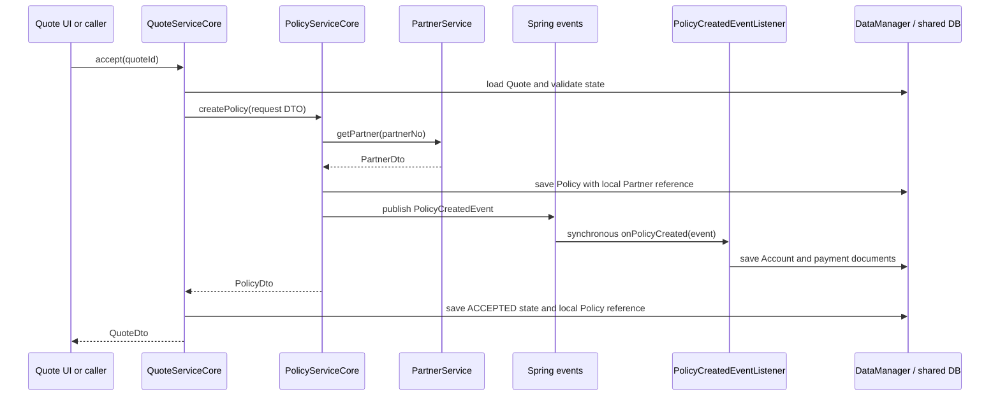

# Domain Model and Runtime Flows

This document describes the current bounded contexts, persistent models, public contracts, and
cross-domain runtime flows. It states what the application does today; decision history belongs in
the [ADRs](../adr/README.md).

## Context Ownership

| Context | Owns | Does not own |
|---|---|---|
| Partner | Partner identity and master data | Policies, Quotes, Accounts |
| Product | Product types, variants, payment frequencies, insurance products and premium rules | Customer-specific or policy-specific state |
| Quote | Quote lifecycle and the local data needed to produce a Policy | The created Policy or its Account |
| Policy | Active contract state and Policy-centric views of Partner data | Partner master data or accounting documents |
| Account | Accounting periods, balances, payment documents and an Account-centric Policy reference | The Policy aggregate |
| Claim | No business model implemented yet | Existing domain state |
| Security | Users and authentication integration | Domain-specific permission details |

Each domain owns its vocabulary at its boundary. A concept with the same business origin can have a
different local representation in another context.

## Persistent Model

### Partner

`Partner` is stored in `PARTNER_PARTNER` and identified by a UUID plus the generated business key
`partnerNo` (`PT-NNNNN`). It stores first and last name. `PartnerEventListener` assigns the business
key before first persistence through a Jmix sequence.

### Quote

`Quote` is stored in `QUOTE_QUOTE`. It owns:

- its generated `quoteNo` (`QT-NNNNN`);
- lifecycle status (`PENDING`, `ACCEPTED`, or `REJECTED`) and transition timestamps;
- validity dates;
- Product type, variant, selected insurance product, payment frequency, effective date, and square
  meters;
- calculated premium;
- `QuotePartnerReference` for the selected Partner;
- `QuotePolicyReference` for the Policy created by acceptance.

`QuoteEventListener` assigns `quoteNo` on first save. `QuotePremiumService` selects a matching
`InsuranceProduct`, calculates the premium, and applies both to the Quote without persisting it.
`QuoteService` owns acceptance and rejection transitions.

### Policy

`Policy` is stored in `POLICY_POLICY`. It owns:

- generated `policyNo` in the form `<product-code>-<year>-<six-digit sequence>`;
- `PolicyPartnerReference` for the policy holder;
- insurance product and payment frequency values;
- coverage start and end;
- premium.

`PolicyService.createPolicy()` validates API identifiers, resolves the local Partner reference,
sets `coverageEnd` to one year after `coverageStart`, saves the Policy, and publishes
`PolicyCreatedEvent`.

### Account

`Account` is stored in `ACCOUNT_ACCOUNT`. It owns:

- `AccountPolicyReference` containing the Policy and Partner identifiers needed by Accounting;
- accounting period start and end;
- current persisted account balance;
- a composition of `AccountDocument` entries.

The Policy number is also the current Account instance name. `AccountDocument` is stored in
`ACCOUNT_ACCOUNT_DOCUMENT`, has a normal in-domain JPA relationship to its Account, and records a
type, document date, amount, and description.

Account creation divides the Policy premium by the payment frequency. It creates one negative
document for each payment and sets the initial Account balance to the negative full premium.
`AccountService.getAccountBalance()` loads the local Account and its documents, rejects dates after
the local accounting-period end, and sums documents dated on or before the requested date. It does
not load the Policy entity.

### Security User

`User` is stored in `APP_USER`, has Jmix entity name `security_User`, and implements
`JmixUserDetails`. Domain access policies are described in
[Persistence and security](persistence-and-security.md).

### Standard Entity Fields

Persistent business entities declare their own Jmix/JPA identity, version, created/modified audit,
and soft-delete fields. There is no shared persistent superclass across bounded contexts. New Jmix
entity instances are created through `DataManager`, `Metadata`, or `DataContext`, never direct
constructors.

## Local Cross-Domain References

Foreign persistent entities are not part of a consuming domain's JPA model. The current local
references are Jmix `@Embeddable` types owned by the consumer:

| Local type | Embedded in | Stored values |
|---|---|---|
| `QuotePartnerReference` | `Quote` | Partner UUID and Partner number |
| `QuotePolicyReference` | `Quote` | created Policy UUID and Policy number |
| `PolicyPartnerReference` | `Policy` | Partner UUID and Partner number |
| `AccountPolicyReference` | `Account` | Policy UUID, Policy number, Partner number |

These fields are ordinary columns in the consuming table. There are no cross-domain foreign keys,
JPA associations, fetch plans, cascades, or JPQL joins. In-domain relationships remain normal JPA
relationships; `Account` → `AccountDocument` is a composition and has a database foreign key.

The current references contain identifiers and locally required searchable values. There is no
general refresh mechanism for mutable replicated fields yet. If additional mutable values are
added, their update event and consistency behavior must be implemented explicitly in the consuming
domain.

## Public Contracts

### Partner API

- `PartnerService` exposes lookup, paged wildcard search, and save behavior.
- `PartnerDto` is a non-persistent Jmix DTO entity suitable for Jmix data binding.

### Quote API

- `QuoteService` exposes `accept()` and `reject()` operations.
- `QuoteDto` represents the externally visible Quote result.
- Product vocabulary used in the Quote contract comes from `product-api`.

### Policy API

- `PolicyService` creates and retrieves Policies through DTOs.
- `CreatePolicyRequestDto` is the creation command.
- `PolicyDto` is the result/read representation.
- `PolicyCreatedEvent` is the in-process integration event consumed by Account.
- `PartnerPolicyOverviewService` returns Policy summaries for Partner-owned UI contributions.

### Account API

- `AccountService` calculates a balance for a Policy number and effective date.
- `PartnerAccountOverviewService` returns an Account summary for Partner-owned UI contributions.
- Account API DTOs are non-persistent Jmix DTO entities.

API types can be used by another module and by a future external adapter. They do not expose
persistent Core entities.

## Quote Lifecycle

The Quote detail view initializes new Quotes as `PENDING` with a validity window. Premium
calculation is a separate explicit action. Acceptance requires:

- current status `PENDING`;
- a positive calculated premium;
- product, payment frequency, and effective date;
- a current date within the Quote validity window.

Acceptance sets `ACCEPTED`, records `acceptedAt`, and stores the returned Policy identity in the
local `QuotePolicyReference`. Rejection is allowed only from `PENDING`, sets `REJECTED`, and records
`rejectedAt`. A Quote cannot be accepted or rejected twice.

## Quote → Policy → Account Flow

### Transaction Semantics

The current communication is in-process:

- `QuoteServiceCore.accept()` is transactional.
- `PolicyServiceCore.createPolicy()` is transactional and joins an existing transaction.
- `ApplicationEventPublisher` delivers `PolicyCreatedEvent` synchronously to
  `PolicyCreatedEventListener`.
- `AccountServiceCore.createAccount()` joins the same transaction.
- Listener exceptions are rethrown.

Therefore, a failure in Account creation prevents the Policy from committing. When the flow began
through Quote acceptance, the Quote state also remains unchanged. `PolicyRollbackTest` verifies the
Policy/Account rollback behavior; `QuoteAcceptanceFlowTest` verifies the complete success path.

The current event is not a durable message and has no broker, retry queue, or transaction outbox.

## Observability

The Quote → Policy → Account flow logs stable event names such as `quote.accept.started`,
`policy.created`, `policy.created.event-published`, and `account.created`. MDC carries
`correlationId`, `quoteNo`, `policyNo`, and `partnerNo` where available. The application log pattern
renders these values. Identifiers are restored after each operation so one invocation does not
leak context into another.

## Modification Checklist

For a domain behavior change:

1. Change the contract in the provider API only when consumers need a new capability or value.
2. Keep persistence and business implementation in the owning Core module.
3. Map between persistent entities and API DTOs inside the provider.
4. Add foreign data to a consumer-owned embeddable only when the consumer needs it locally.
5. Define update semantics before adding mutable replicated values.
6. Update module fixtures, integration tests, and cross-domain flow tests.
7. Update this document when ownership, contracts, or runtime flow semantics change.

## Primary Source Files

- [`QuoteServiceCore`](../../quote/quote-core/src/main/java/com/insurance/quote/core/service/QuoteServiceCore.java)
- [`PolicyServiceCore`](../../policy/policy-core/src/main/java/com/insurance/policy/core/service/PolicyServiceCore.java)
- [`PolicyCreatedEvent`](../../policy/policy-api/src/main/java/com/insurance/policy/api/event/PolicyCreatedEvent.java)
- [`PolicyCreatedEventListener`](../../account/account-core/src/main/java/com/insurance/account/core/listener/PolicyCreatedEventListener.java)
- [`AccountServiceCore`](../../account/account-core/src/main/java/com/insurance/account/core/service/AccountServiceCore.java)
- [`QuoteAcceptanceFlowTest`](../../webapp/src/test/java/com/insurance/app/quote/QuoteAcceptanceFlowTest.java)
- [`PolicyRollbackTest`](../../webapp/src/test/java/com/insurance/app/policy/PolicyRollbackTest.java)
