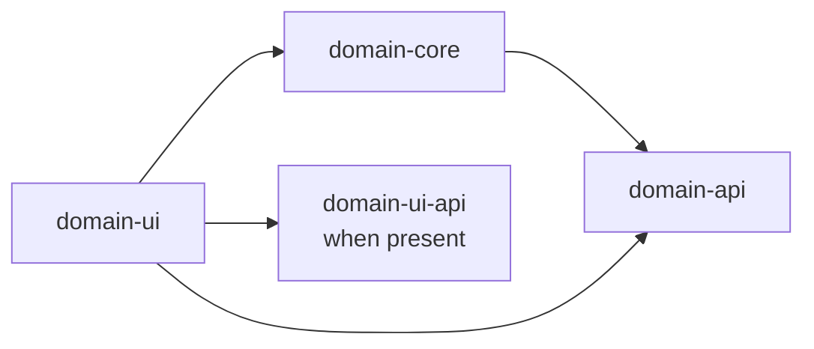
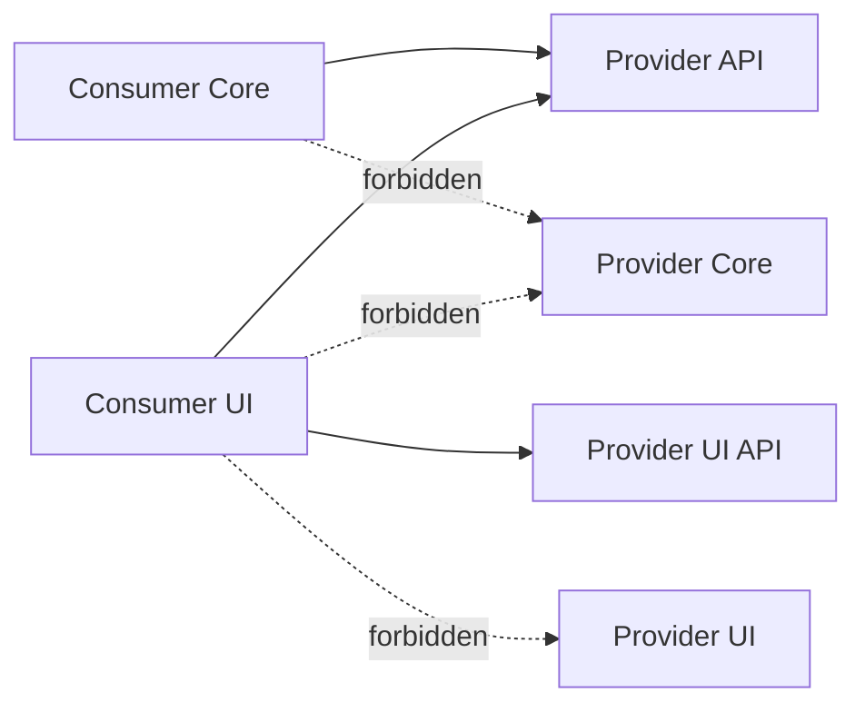

# Modules and Boundaries

This document describes the current build topology, artifact responsibilities, package layout, and
allowed dependency directions. Decision rationale is recorded separately in the
[ADR index](../adr/README.md).

## Runtime and Build Topology

The repository is a Gradle composite build. The root `settings.gradle` includes twelve builds:

| Build | Kind | Runtime role |
|---|---|---|
| `webapp` | Application | Starts the single Spring Boot process and installs domain starters |
| `partner` | Domain add-on | Partner master data |
| `quote` | Domain add-on | Quotes and acceptance |
| `policy` | Domain add-on | Insurance policies |
| `account` | Domain add-on | Accounts and accounting documents |
| `claim` | Domain add-on shell | Installed placeholder for claims |
| `product` | Supporting add-on | Product vocabulary and premium rules |
| `security` | Supporting add-on | Users and full-access role |
| `theme` | Shared add-on | Application theme resources |
| `ui-sections` | Shared library | Cross-module Flow UI section contract |
| `test-support` | Test library | Entity data, assertions, authentication, architecture rules |
| `test-support-ui` | Test library | Flow UI interactions and UI architecture rules |

The domain builds apply `gradle/jmix-domain-conventions.gradle`. The convention configures Jmix,
Java 21, publishing, test fixtures, JaCoCo, PMD, and SpotBugs for their subprojects. A domain's
`jmixDomainProjectId` defines the Jmix entity-name prefix used by its persistent entities.

## Domain Artifact Layout

The standard domain layout is:

| Artifact | Current contents | May depend on |
|---|---|---|
| `<domain>-api` | Interfaces, Jmix DTO entities, events, enums | Jmix Core/Data and other API artifacts |
| `<domain>-api-starter` | Spring Boot auto-configuration for API installation | Its API artifact and Spring/Jmix bootstrap APIs |
| `<domain>-core` | JPA entities, services, repositories, listeners, changelogs, entity roles | Own API and foreign API artifacts |
| `<domain>-core-starter` | Spring Boot auto-configuration for Core installation | Its Core artifact |
| `<domain>-ui` | View controllers, XML descriptors, fragments, menus, UI roles | Own Core/API, foreign API/UI API, Flow UI |
| `<domain>-ui-starter` | Spring Boot auto-configuration for UI installation | Its UI artifact |

`partner` and `policy` additionally publish `partner-ui-api` and `policy-ui-api`. These artifacts
contain the typed section and context contracts used by contributors to extend host-owned detail
views. Both depend on the shared `ui-sections` library.

All seven domain/supporting builds currently declare the standard six artifacts. Some are shells:

- `claim` has configuration, starters, menu and theme resources but no entity, service, or view.
- `product` has product vocabulary in API and product configuration in Core. Its UI artifact has no
  business view, and `product-ui-starter` is not installed by `webapp`.
- `partner` and `policy` have seven artifacts because of their extra UI API.

## Package and Resource Ownership

For a domain named `policy`, production artifacts use these locations:

```text
com.insurance.policy.api..          public contracts and DTOs
com.insurance.policy.core..         persistence and business implementation
com.insurance.policy.ui.api..       host UI contribution contract
com.insurance.policy.ui..           Flow UI implementation
com/insurance/policy/**             module resources
```

The repeated layout is functional. Architecture rules derive the owning domain and layer from the
package and build path. New production classes must stay below their corresponding package.

## Dependency Direction

Within one bounded context, UI has pragmatic access to its own persistent model:



Across bounded contexts, the dependency target changes:



The compile classpath and architecture rules both express this model. Adding a foreign Core
dependency to make an import compile does not make that import architecture-compliant.

## Declared Cross-Domain Dependencies

The following production dependencies are currently declared. Starter edges are omitted from the
table when they only install the corresponding artifact.

| Consumer | Provider contracts | Current use |
|---|---|---|
| `account-core` | `policy-api`, `product-api` | Receives `PolicyCreatedEvent`; uses product payment frequency |
| `account-ui` | `partner-ui-api`, `policy-ui-api` | Contributes Account sections to Partner and Policy detail views |
| `claim-api` | `product-api` | Declared foundation for future Claim contracts |
| `claim-core` | `partner-api`, `policy-api` | Declared foundation; no business implementation yet |
| `partner-ui` | `policy-ui-api` | Contributes policy-holder content to Policy details |
| `policy-core` | `partner-api`, `account-api`, `product-api` | Partner lookup, declared Account API integration, product vocabulary |
| `policy-ui` | `partner-ui-api` | Contributes Policy summaries to Partner details |
| `quote-api` | `product-api` | Exposes shared product values in Quote contracts |
| `quote-core` | `partner-api`, `policy-api`, `product-api` | Partner reference, Quote-to-Policy conversion, premium inputs |

`BusinessModuleDependencyRules` defines the allowed horizontal domain graph, while
`ModuleLayerDependencyRules` prevents a legal horizontal edge from reaching the wrong layer.

## Public API Contents

An API artifact can contain:

- service interfaces;
- request/response DTOs and Jmix DTO entities;
- application events whose payload contains API types and scalar values;
- stable enums and value vocabulary intentionally shared with consumers;
- its Jmix API module configuration.

It does not contain:

- JPA `@Entity` or `@Embeddable` persistence models;
- repositories or service implementations;
- Liquibase production changelogs;
- Flow UI controllers, fragments, descriptors, menus, or UI roles;
- imports from any `core` or `ui` package.

DTOs that participate in Jmix UI data binding are non-persistent `@JmixEntity` types with one
`@JmixId`. They are contracts, not a shared JPA model.

## Core and UI Contents

Core owns:

- persistent entities and local embeddables;
- business services and their API implementations;
- repositories and entity/application event listeners;
- module-owned Liquibase changelogs;
- Core resource roles for entity and attribute permissions.

UI owns:

- Java view controllers and XML view descriptors;
- reusable Jmix fragments;
- menu contributions, message bundles, and module styles;
- UI resource roles for view and menu access;
- in-domain binding to its own Core entities.

Core code is Flow UI independent. View controllers call Core services for business behavior and do
not import foreign Core entities.

## Starter Artifacts

Each starter publishes a Spring Boot auto-configuration entry in
`META-INF/spring/org.springframework.boot.autoconfigure.AutoConfiguration.imports`. Starters make a
Jmix add-on installable without requiring the application to enumerate all configuration classes.
They contain bootstrap configuration, not business behavior.

The `webapp` installs API, Core, and UI starters for Security, Account, Policy, Quote, Claim, and
Partner. It installs Product API and Core starters and the shared Theme. It also declares the Jmix
platform starters needed by the complete application.

## Composition Root

`webapp` owns application-wide assembly:

- the executable `WebappApplication`;
- selected starter dependencies;
- Login and Main views;
- the application menu and composite-menu activation;
- the master Liquibase changelog;
- application personas composed from module roles;
- assembled integration, UI, architecture, and role-composition tests.

Domain details do not move into `webapp` merely because the application installs the module. A
domain entity change remains in its Core artifact; the webapp only composes the installed result.

## Modification Checklist

When adding or moving an artifact:

1. Place the class and resources in the owning domain and layer.
2. Declare only the API/UI API dependencies needed by consumers.
3. Add or update the module's Jmix configuration and starter only when installation changes.
4. Update the webapp dependency, changelog composition, and application roles when installing a
   new module.
5. Update this document when the allowed module graph or artifact pattern changes.
6. Run the focused architecture suite described in [Automated guardrails](automated-guardrails.md).

## Primary Source Files

- [`settings.gradle`](../../settings.gradle) defines the composite builds.
- [`jmix-domain-conventions.gradle`](../../gradle/jmix-domain-conventions.gradle) configures domain builds.
- [`webapp/build.gradle`](../../webapp/build.gradle) selects installed starters.
- [`ArchitectureProject`](../../test-support/src/main/java/com/insurance/common/test_support/architecture/project/ArchitectureProject.java) maps package conventions.
- [`ModuleLayerDependencyRules`](../../test-support/src/main/java/com/insurance/common/test_support/architecture/rules/layer/ModuleLayerDependencyRules.java) enforces vertical direction.
- [`BusinessModuleDependencyRules`](../../test-support/src/main/java/com/insurance/common/test_support/architecture/rules/insurance/BusinessModuleDependencyRules.java) enforces the horizontal domain graph.
