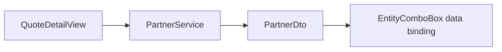
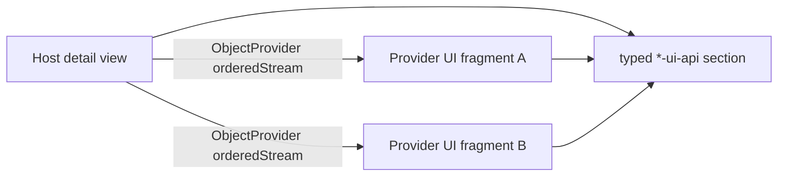

# UI Architecture

This document describes the current Jmix Flow UI structure and both implemented cross-module UI
integration patterns.

## UI Ownership

Every domain UI artifact owns its Java view controllers, XML descriptors, menu contribution,
message bundle, styles, fragments, and UI resource roles. A normal entity view binds directly to
the persistent entity from its own Core artifact.

| Domain | Current views |
|---|---|
| Partner | `partner_Partner.list`, `partner_Partner.detail` |
| Quote | `quote_Quote.list`, `quote_Quote.detail` |
| Policy | `policy_Policy.list`, `policy_Policy.detail` |
| Account | `account_Account.list`, `account_Account.detail` |
| Security | `security_User.list`, `security_User.detail` |
| Webapp | `app_LoginView`, `app_MainView` |

Claim and Product currently have no business views. The application menu is composite, so
installed modules contribute their menu entries through module-owned `menu.xml` files.

Each view has:

- a `@ViewController` ID prefixed with the owning module;
- a Java controller below the domain's `ui.view` package;
- an XML descriptor below the matching resource package;
- message keys in the module bundle;
- view and menu policies in the owning UI role.

## Responsibility Split

View controllers manage presentation behavior:

- component state and event subscriptions;
- navigation and dialog orchestration;
- data-container interaction;
- invoking services;
- translating failures into localized notifications.

Business transitions, persistence rules, number generation, and cross-domain orchestration remain
in Core services or event listeners. Controllers may call their own Core services and foreign API
interfaces, but they do not import foreign Core entities or foreign UI implementations.

## Consumer-Owned Cross-Domain UI

When the consuming use case owns the interaction and rendering, the consumer calls the provider's
API and builds the UI itself.

The current example is Partner selection in `QuoteDetailView`:



- `quote-ui` depends on `partner-api`, not `partner-core` or `partner-ui`.
- `PartnerService.findPartners()` supplies filtered, offset, and limited results.
- `PartnerDto` is a Jmix DTO entity and is bound directly to `EntityComboBox<PartnerDto>`.
- Quote UI controls labels, fields, selection behavior, and which returned values are copied into
  `QuotePartnerReference`.

Use this pattern for a bounded interaction whose layout and user journey belong to the consumer.

## Provider-Owned UI Contributions

Partner and Policy detail views expose extension points for optional sections supplied by other
modules. The generic contract lives in `ui-sections`:

```java
public interface ViewSection<C> {
  String titleMessageKey();

  Component createContent(C context, FragmentOwner fragmentOwner);
}
```

The host publishes a typed specialization and context in its `*-ui-api` artifact:

| Host | Contract | Context values |
|---|---|---|
| Partner detail | `PartnerSection` | Partner UUID and Partner number |
| Policy detail | `PolicySection` | Policy UUID, Policy number, Partner number, coverage dates |

Contributors implement the contract as ordered Spring beans:

| Host | Contributor | Bean | Order |
|---|---|---|---|
| Partner detail | Policy UI | `PartnerPoliciesSection` | 100 |
| Partner detail | Account UI | `PartnerAccountSection` | 200 |
| Policy detail | Partner UI | `PolicyHolderSection` | 100 |
| Policy detail | Account UI | `PolicyAccountBalanceSection` | 200 |



The host:

- owns the page route, entity, layout, section container, surrounding `Details` components, and
  open/closed presentation;
- creates the small immutable context from its local entity;
- discovers all section beans through `ObjectProvider` and renders them by Spring order;
- resolves each title message key from the contributor's message bundle.

The contributor:

- depends on the host's UI API, not the host UI implementation;
- owns the service lookup and Jmix fragment that render its information;
- uses the context identifiers to load its own local model or API data;
- returns a Vaadin component and does not control the host layout.

The context contains identifiers and stable host data only. It does not expose the host's
persistent entity or view controller.

## Fragment Construction

Provider sections create Jmix fragments through `Fragments.create(fragmentOwner, FragmentClass)`.
The supplied `FragmentOwner` keeps fragment lifecycle and dependency injection inside the active
host view. The section passes context values to the fragment and returns its content component.

Each fragment owns:

- its Java fragment controller;
- its XML fragment descriptor;
- provider-specific service calls and formatting;
- its message keys and test coverage.

## Current View Behavior

### Quote

- Quote list exposes service-backed Accept and Reject actions and reloads after the operation.
- Quote detail loads Partner DTOs lazily through `PartnerService`.
- `QuotePremiumService` performs product selection and premium calculation.
- Saving remains disabled until a valid premium has been calculated.
- Accepted and rejected Quotes are read-only.

### Policy and Account

- Policies and Accounts are created by the Quote → Policy → Account flow, not manually in their
  list views.
- Policy detail renders Partner and Account provider sections.
- Account detail displays the AccountDocument composition.

### Partner

- Partner detail renders Policy and Account provider sections.
- The host determines section order and presentation; providers determine section content.

## UI Testing Surface

Jmix UI integration tests use `@UiTest` and `FlowuiTestAssistConfiguration`. Shared helpers in
`test-support-ui` cover view navigation, forms, grids, and common component interactions. Stable
component IDs are the preferred selector contract. See [Testing strategy](testing-strategy.md) for
scope and fixture conventions.

## Modification Checklist

For a view change:

1. Keep the Java controller and XML descriptor in matching domain UI packages.
2. Add stable IDs to components that tests or controller subscriptions address.
3. Put visible text in the owning message bundle.
4. Add or update view and menu policies in the owning UI role.
5. Put business behavior in a Core service and call it from the controller.
6. Use provider API DTOs for consumer-owned cross-domain UI.
7. Use a typed host UI API and provider fragment for open-ended provider-owned sections.
8. Update the appropriate UI integration test and run the UI/architecture checks.

## Primary Source Files

- [`QuoteDetailView`](../../quote/quote-ui/src/main/java/com/insurance/quote/ui/view/quote/QuoteDetailView.java) demonstrates consumer-owned UI.
- [`ViewSection`](../../ui-sections/src/main/java/com/insurance/ui/section/ViewSection.java) is the generic section contract.
- [`PartnerSection`](../../partner/partner-ui-api/src/main/java/com/insurance/partner/ui/api/PartnerSection.java) and [`PartnerViewContext`](../../partner/partner-ui-api/src/main/java/com/insurance/partner/ui/api/PartnerViewContext.java) define the Partner host SPI.
- [`PolicySection`](../../policy/policy-ui-api/src/main/java/com/insurance/policy/ui/api/PolicySection.java) and [`PolicyViewContext`](../../policy/policy-ui-api/src/main/java/com/insurance/policy/ui/api/PolicyViewContext.java) define the Policy host SPI.
- [`PartnerDetailView`](../../partner/partner-ui/src/main/java/com/insurance/partner/ui/view/partner/PartnerDetailView.java) and [`PolicyDetailView`](../../policy/policy-ui/src/main/java/com/insurance/policy/ui/view/policy/PolicyDetailView.java) discover contributions.
- [`PolicyAccountBalanceSection`](../../account/account-ui/src/main/java/com/insurance/account/ui/view/policy/PolicyAccountBalanceSection.java) is a provider example.
