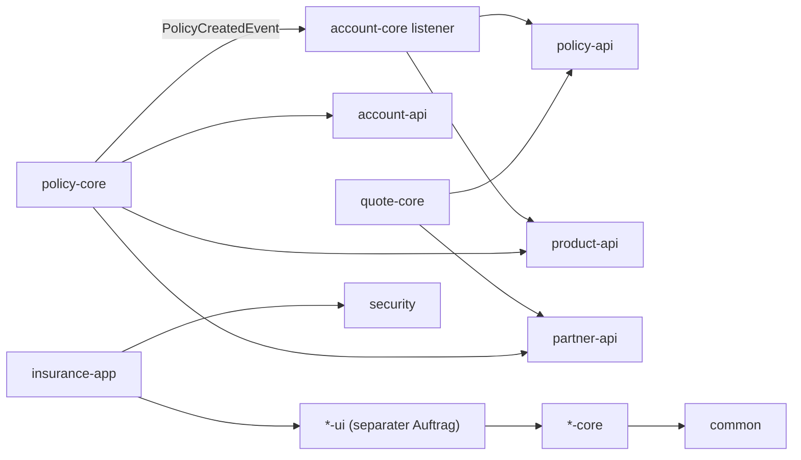
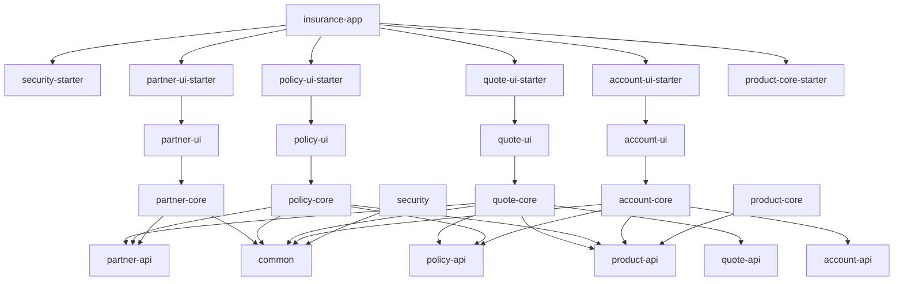

# Architektur-Review: Modulstruktur jmix-insurance

Stand: 2026-05-31. Analysiert wurden Composite-Build, Gradle-Abhaengigkeiten, Jmix-Konfigurationen, Starter, Entities, Services, Listener, Views, Liquibase und Tests.

Hinweis zur Abgrenzung: Der separate Implementierungsauftrag "Split Domain Modules into Core and UI" ist hier als bereits beauftragt angenommen. Dieses Review wiederholt daher nicht mehr die konkrete Arbeit, View-Controller, XML-Deskriptoren, Menues, Messages und FlowUI-Abhaengigkeiten aus `partner-core`, `policy-core`, `quote-core` und `account-core` in neue `*-ui`-/`*-ui-starter`-Module zu verschieben.

## Kurzfazit

Die fachliche Grundidee ist gut erkennbar: `insurance-app` ist die Shell, Fachdomänen liegen in eigenen Add-ons, und die meisten Domänen sind in `*-api`, `*-core` und `*-starter` getrennt. Das ist fuer Jmix grundsätzlich ein tragfaehiges Modularisierungsmuster.

Der aktuelle Stand ist aber eher ein modularisierter Monolith als eine sauber entkoppelte Modularchitektur. Die Modulgrenzen werden auf Build-Ebene stark aufgeweicht, API-Module ziehen Jmix UI/Data-Infrastruktur mit, Core-Module exportieren ihre Abhaengigkeiten zu breit ueber `api`, und einige Dateien deuten auf Copy/Paste-Drift zwischen Modulen hin. Nach dem bereits beauftragten UI-Split sollte der Fokus daher auf leichten API-Modulen, klaren transitive-Dependency-Regeln, Modulidentitaet und Security-/Event-Grenzen liegen.

## Aktuelle Modulstruktur

Root-Projekt:

- `settings.gradle` bindet die Teilprojekte per `includeBuild` als Gradle Composite ein.
- Jedes Add-on ist wiederum ein eigener Gradle-Build mit zwei Subprojekten: fachliches Modul und Starter.
- `insurance-app` konsumiert die Starter-Artefakte und startet die Jmix-Anwendung.

Fachliche Module:

- `common`: gemeinsame Basisklassen und gemeinsame Value-/Utility-Typen.
- `security`: User-Entity, User-Views, UserRepository und FullAccessRole.
- `partner-api` / `partner-core`: Partner-DTOs und Servicevertrag / Partner-Persistence und Service. UI wird gemaess separatem Auftrag nach `partner-ui` verschoben.
- `product-api` / `product-core`: Produkt-Enums/-Katalog in API, derzeit fast kein Core-Verhalten.
- `quote-api` / `quote-core`: Quote-DTOs und Servicevertrag / Quote-Entity und QuoteService. UI wird gemaess separatem Auftrag nach `quote-ui` verschoben.
- `policy-api` / `policy-core`: Policy-DTOs, Event und Servicevertrag / Policy-Entity und PolicyService. UI wird gemaess separatem Auftrag nach `policy-ui` verschoben.
- `account-api` / `account-core`: Account-DTO und Servicevertrag / Account-Entity, Listener und AccountService. UI wird gemaess separatem Auftrag nach `account-ui` verschoben.

Grobe fachliche Flussrichtung:

## Positive Befunde

- Die Domänenschnitte `partner`, `product`, `quote`, `policy`, `account`, `security` sind fachlich nachvollziehbar.
- Das API/Core/Starter-Muster ist grundsätzlich sinnvoll: andere Module koennen gegen Service-Interfaces und DTOs arbeiten, waehrend die Implementierung in Core bleibt.
- Cross-Modul-Kommunikation nutzt meistens Services und DTOs statt direkt fremde Entities zu laden. Beispiele: `quote-core` ruft `PolicyService`, `policy-core` publiziert `PolicyCreatedEvent`, `account-core` konsumiert `PolicyService`.
- Persistente Fachobjekte liegen weitgehend in den `*-core`-Modulen statt in der Shell-App.
- Der bereits beauftragte UI-Split passt gut zum Add-on-Muster: Core-Module bleiben fachlich/backend-orientiert, UI-Module duerfen direkt die eigenen Core-Entities verwenden.
- Dezentrale Liquibase-Changelogs pro Modul sind angelegt und im App-Master-Changelog eingebunden.
- Es gibt bereits App-Integrationstests fuer zentrale End-to-End-Flows: Quote akzeptieren, Policy erzeugen, Account erzeugen.

## Wichtigste Risiken

### 1. API-Module sind technisch zu schwergewichtig

Die `*-api`-Module enthalten zwar meist nur DTOs, Enums und Service-Interfaces, haengen aber buildseitig an:

- `io.jmix.core:jmix-core-starter`
- `io.jmix.data:jmix-eclipselink-starter`
- `io.jmix.flowui:jmix-flowui-starter`
- `io.jmix.flowui:jmix-flowui-themes`

Ausserdem deklarieren die API-Konfigurationen `@JmixModule(dependsOn = {EclipselinkConfiguration.class, FlowuiConfiguration.class})` und registrieren ViewControllers/Actions fuer API-Packages, obwohl dort keine Views liegen.

Auswirkung: Ein eigentlich leichter Vertrag wird zu einem Jmix-UI/Data-Modul. Das erschwert Wiederverwendung, Tests, Abhaengigkeitsanalyse und spaetere Auslagerung.

Empfehlung:

- API-Module auf das Minimum reduzieren: DTO-Metadaten, Enums, Service-Interfaces, Events.
- Wenn DTOs bewusst Jmix DTO-Entities sind, reicht typischerweise Jmix Core-Metadatenunterstuetzung; Flow UI und Eclipselink sollten nicht pauschal im API-Modul haengen.
- ViewController-/Action-Beans aus API-Konfigurationen entfernen, solange API-Module keine eigenen UI-Komponenten enthalten.

### 2. Core-Module exportieren Abhaengigkeiten zu breit

Viele Core-Gradle-Dateien verwenden `api` fuer andere Module, z.B.:

- `policy-core` exportiert `policy-api`, `partner-api`, `account-api`, `product-api`, `common`.
- `account-core` exportiert `account-api`, `policy-api`, `product-api`, `common`.
- `quote-core` exportiert `quote-api`, `partner-api`, `policy-api`, `common`.

Damit werden fremde APIs transitiv an alle Konsumenten weitergereicht. Das macht die effektive Architektur breiter als die fachliche Architektur.

Empfehlung:

- `api` nur fuer Typen verwenden, die wirklich Teil der oeffentlichen Binärschnittstelle eines Moduls sind.
- Die meisten Cross-Modul-Abhaengigkeiten in Core-Modulen auf `implementation` umstellen.
- `core-starter -> api project(':core')` kann bleiben; innerhalb des Core-Moduls sollte aber nicht alles transitiv exportiert werden.

### 3. App-Komposition nach dem UI-Split klarziehen

`insurance-app/build.gradle` zieht pro Domäne aktuell meist Core- und API-Starter gemeinsam:

- `account-core-starter` und `account-api-starter`
- `policy-core-starter` und `policy-api-starter`
- `quote-core-starter` und `quote-api-starter`
- `partner-core-starter` und `partner-api-starter`
- `product-core-starter` und `product-api-starter`

Der separate UI-Split wird zusaetzlich `partner-ui-starter`, `policy-ui-starter`, `quote-ui-starter` und `account-ui-starter` einfuehren. Danach sollte die App-Komposition einmal bewusst bereinigt werden, damit nicht Core-, UI- und API-Starter redundant nebeneinander stehen.

Empfehlung:

- App bevorzugt an die Feature-Starter haengen, die wirklich die lauffaehige Funktion liefern, voraussichtlich `*-ui-starter` fuer user-facing Domänen und `product-core-starter`/`security-starter` fuer reine Backend-/Infrastrukturmodule.
- API-Starter nur dann direkt in der App einbinden, wenn die App bewusst ohne Core-/UI-Implementierung gegen eine API laufen soll.
- Nach dem UI-Split pruefen, welche Starter transitiv bereits gezogen werden.

### 4. UI-Split als erledigtes Architektur-Thema nachhalten

Der konkrete Split von `partner-core`, `policy-core`, `quote-core` und `account-core` in Backend-Core und neue UI-Module ist bereits an einen anderen Agenten gegeben. Dieses Review bewertet das deshalb nicht mehr als offene Hauptmassnahme.

Was nach dem Split noch zu pruefen bleibt:

- Die neuen `*-ui`-Module sollten nur Presentation-Code, XML-Deskriptoren, Menues und UI-Messages enthalten.
- Fachliche Entscheidungen bleiben in Services/Listenern der Core-Module.
- UI darf eigene Core-Entities direkt verwenden, sollte fremde Domänen aber weiter ueber API-Services/DTOs ansprechen.
- Hart kodierter UI-Text, z.B. in `QuoteListView`, sollte beim Umzug in UI-Module in Message Keys ueberfuehrt werden.

Empfehlung:

- Nach Umsetzung des UI-Splits eine kurze Nachpruefung machen: keine `view`-Packages/XML-Views mehr in den vier Backend-Core-Modulen, keine FlowUI-Starter mehr in deren Core-Gradle-Dateien, Jmix `@JmixModule`-Dependencies sauber getrennt.
- Message Keys fuer UI-Benachrichtigungen beim Umzug vervollstaendigen.

### 5. Copy/Paste-Drift in Produktmodulen

Im `product-core` liegen Ressourcen unter `view/partner`, die auf `com.insurance.partner.core.entity.Partner` und `partner_Partner` zeigen. Auch Testressourcen liegen unter `com/insurance/partner/core`. Im `product-api` liegen Tests im Package `com.insurance.partner.api` und importieren Partner-Konfigurationen.

Auswirkung: Das ist ein starkes Signal, dass Modul-Templates kopiert wurden und die Modulidentitaet nicht ueberall bereinigt ist. Das kann Tests falsch absichern, Jmix-Scanning verwirren und spaeter versehentlich Partner-Artefakte aus Produktmodulen laden.

Empfehlung:

- `product-api` und `product-core` komplett auf Partner-Namensreste pruefen.
- Falsche Partner-Views/Testressourcen entfernen oder korrekt als Product-Artefakte ausmodellieren.
- Einen einfachen Architekturtest ergaenzen: kein `product-*` darf `com.insurance.partner.core` referenzieren.

### 6. Security ist als Fachmodul ausgelagert, Rollenmodell aber sehr grob

Das neue `security`-Modul kapselt User-Entity, UserRepository, User-Views und `FullAccessRole`. Das ist als Infrastrukturmodul sinnvoll. Es gibt aber nur:

- `FullAccessRole` mit Wildcards fuer alles.
- `UiMinimalRole` in der App fuer Login/MainView.

Fachmodule liefern keine eigenen Rollen fuer ihre Entities, Views und Menues.

Auswirkung: Die Module sind fachlich getrennt, aber nicht sicherheitlich autonom. Neue Module bringen keine klaren Zugriffsregeln mit.

Empfehlung:

- Pro fachlichem Modul mindestens eine ResourceRole definieren, z.B. `partner-read`, `partner-manage`, `quote-manage`.
- Rollen in dem Modul halten, das auch Entity/View/Menu besitzt.
- Wildcard-FullAccess nur fuer System/Admin-Testzwecke verwenden.

### 7. Modul-Tests sind zu oft nur Context-Smoke-Tests

Die einzelnen API/Core-Module haben viele `contextLoads()`-Tests. Die wirklich aussagekraeftigen fachlichen Tests liegen vor allem in `insurance-app`. Das prueft End-to-End-Flows, laesst aber Modulgrenzen selbst relativ ungeschuetzt.

Empfehlung:

- Je Core-Modul gezielte Service-Tests halten, die nur das Modul plus benoetigte API-Mocks starten.
- App-Integrationstests fuer Cross-Modul-Flows behalten.
- Architekturtests ergaenzen, z.B. mit ArchUnit oder einfachen Gradle/RG-basierten Checks:
  - API-Module duerfen keine Core-Packages importieren.
  - Core-Module duerfen fremde Core-Module nicht direkt importieren.
  - Produktmodule duerfen keine Partner-Packages referenzieren.
  - API-Module duerfen keine Flow-UI-Views enthalten.

### 8. Policy- und Account-Erzeugung sollen atomar bleiben

`PolicyServiceCore.createPolicy()` speichert eine Policy und publiziert danach `PolicyCreatedEvent`. `account-core` hoert darauf und erzeugt ein Account. Fachliche Vorgabe: Policy-Erzeugung und Account-Erzeugung sollen gemeinsam in einer Transaktion laufen. Ein Fehler bei der Account-Erzeugung soll die Policy-Erzeugung zurueckrollen, statt spaeter einen halb fertigen Zustand zu reparieren.

Auswirkung: Der synchrone Prozess ist fachlich gewollt, muss aber explizit als In-Transaction-Orchestrierung behandelt werden. Aktuell loggt der Listener einige Fehler und bricht still ab; das passt nicht zu einer atomaren Fachoperation, weil dadurch trotz fehlendem Account eine Policy entstehen kann.

Empfehlung:

- Atomare Semantik dokumentieren: `createPolicy()` ist erst erfolgreich, wenn Policy und initialer Account gespeichert sind.
- Den aktuellen normalen Spring-Event nur behalten, wenn klar dokumentiert und getestet ist, dass Listener synchron in derselben Transaktion laeuft und Fehler nicht verschluckt werden.
- Besser pruefen: expliziter synchroner Domain-Service/Orchestrator fuer `createPolicyWithAccount`, der `PolicyServiceCore` und `AccountServiceCore` in einer `@Transactional` Boundary koordiniert. Das macht die Atomaritaet sichtbarer als ein impliziter Event-Listener.
- Listener darf bei fachlich notwendigen Mutationen nicht nur loggen und returnen; Fehler muessen als Exception durchlaufen, damit Rollback passiert.
- Event-/Command-Payload moeglichst vollstaendig halten, damit Account nicht direkt wieder `PolicyService.findPolicyById()` aufrufen muss.

### 9. Domänenreferenzen sollten auf UUIDs umgestellt werden

Beispiele:

- `Account.policyId` ist ein `String`, obwohl es eine Policy-ID repraesentiert.
- `Account.accountNo` entspricht faktisch `Policy.policyNo`.
- Quote speichert `createdPolicyId` und `createdPolicyNo` als Strings.
- Partner-Verweise laufen ueber `partnerNo`.

Die Richtung sollte hier klarer sein: Modulgrenzen koennen weiterhin ohne fremde JPA-Relations eingehalten werden, aber technische Referenzen zwischen Domänen sollten als `UUID` modelliert werden, nicht als `String` oder nur als Business-Key. Business-Keys wie `policyNo`, `quoteNo`, `partnerNo` bleiben fachliche Such-/Anzeige- und Integrationswerte, sollten aber nicht die einzige interne Referenz sein.

Empfehlung:

- Technische Cross-Domain-Referenzen auf `UUID` umstellen, z.B. `Account.policyId` und `Quote.createdPolicyId`.
- Business-Keys zusaetzlich behalten, wenn sie fachlich gebraucht werden, aber klar benennen: `policyNo`, `createdPolicyNo`, `partnerNo`.
- `accountNo` fachlich klaeren: Wenn es eigentlich die Policy-Nummer ist, besser explizit `policyNo` nennen; wenn Account eine eigene Nummer hat, eigene Account-Nummer generieren und `policyId`/`policyNo` separat halten.
- Keine fremden Core-Entities als JPA-Relation einfuehren, solange die Modulgrenze bewusst ueber API/DTO und technische IDs laufen soll.
- Unique-Constraints fuer Business-Keys pruefen.

### 10. Build-Konfiguration ist stark dupliziert

Fast jedes Add-on wiederholt dieselben Blöcke fuer Jmix Plugin, Repositories, Publishing, JavaCompile, Hilla-Excludes und Test-Konfiguration.

Auswirkung: Aenderungen an Jmix-Version, Publishing oder Testverhalten muessen mehrfach nachgezogen werden. Das erhoeht Drift-Risiko.

Empfehlung:

- Convention Plugin oder gemeinsame Gradle-Skriptlogik einfuehren, z.B. `build-logic` oder `gradle/jmix-addon-conventions.gradle`.
- Jmix-Version und gemeinsame Dependency-Versionen zentralisieren.
- Publishing-Credentials nicht mit Default `admin/admin` im Buildfile fuehren.

## Zielbild

Ein robustes Zielbild waere:

Kernprinzipien:

- API-Module sind leicht und enthalten keine UI/Persistence-Implementierung.
- Core-Module implementieren die API und besitzen Entity, Service, Listener und Liquibase ihrer Domäne.
- UI-Module besitzen View-Controller, XML-Deskriptoren, Menues und UI-Messages ihrer Domäne.
- Fremde Core-Module werden nicht direkt importiert.
- App setzt Module zusammen, enthaelt aber moeglichst wenig Fachlogik.
- Starter aktivieren genau ein Modul und dessen benoetigte Konfiguration.

## Konkrete naechste Schritte

1. Product-Module bereinigen: alle Partner-Artefakte aus `product-api` und `product-core` entfernen oder korrekt umbenennen.
2. Nach Abschluss des separaten UI-Splits die App-Komposition bereinigen: keine redundant nebeneinanderstehenden Core-/UI-/API-Starter, klare `@JmixModule`-Dependencies.
3. API-Module verschlanken: FlowUI/Eclipselink-Abhaengigkeiten und ViewController/Actions-Konfiguration pruefen und entfernen, wo ungenutzt.
4. Gradle `api` vs. `implementation` auditieren und transitive Exporte reduzieren.
5. Pro Fachmodul ResourceRoles ergaenzen; UI-Policies gehoeren nach dem Split in die UI-Module, Entity-/Service-nahe Rollen in die fachlich passende Domäne.
6. Policy -> Account als atomaren In-Transaction-Flow absichern: Fehler nicht verschlucken, Rollback testen, optional expliziten Orchestrator statt implizitem Event-Listener einfuehren.
7. Technische Cross-Domain-Referenzen auf `UUID` umstellen und Business-Keys nur noch ergaenzend/fachlich verwenden.
8. Architekturtests fuer Import-Regeln einfuehren.
9. Gemeinsame Gradle-Conventions einfuehren, um Drift bei Add-on-Builds zu stoppen.

## Priorisierte Findings

| Prioritaet | Thema | Risiko | Empfehlung |
| --- | --- | --- | --- |
| Hoch | Product-Module enthalten Partner-Artefakte | Falsche Scans, falsche Tests, unklare Modulidentitaet | Sofort bereinigen |
| Hoch | API-Module ziehen UI/Data-Starter | Schwere APIs, schlechte Entkopplung | API-Module verschlanken |
| Hoch | App-Komposition nach UI-Split unklar | Redundante Core-/UI-/API-Starter, doppelte Jmix-Konfiguration | Nach UI-Split bereinigen |
| Mittel | Zu breites `api` in Gradle | Transitive Kopplung | `implementation` als Default |
| Mittel | Keine fachmodularen Rollen | Security nicht modular | Rollen pro Fachmodul |
| Mittel | Policy -> Account muss atomar sein | Fehler koennen sonst Policy ohne Account hinterlassen | In-Transaction-Flow absichern |
| Mittel | Cross-Domain-Referenzen als Strings/Business-Keys | Schwache Typisierung, unklare fachliche vs. technische Referenzen | UUIDs fuer technische Referenzen |
| Mittel | Build-Duplikation | Drift bei Versionen/Konfiguration | Convention Plugin |
| Niedrig | Context-only Modul-Tests | Wenig Schutz fuer Modulgrenzen | Architektur- und Service-Tests |

## Offene Fragen

- Soll diese Struktur bewusst ein modularer Monolith bleiben, oder ist spaetere Auslagerung einzelner Domänen geplant?
- Sind API-Module auch fuer externe Clients gedacht, oder nur fuer interne Cross-Modul-Aufrufe?
- Soll `product-core` ueberhaupt existieren, solange der Produktkatalog rein enum-/regelbasiert im `product-api` liegt?
- Nach dem UI-Split: Soll die App nur `*-ui-starter` konsumieren, oder sollen Core-Starter fuer nicht sichtbare Backend-Funktionen weiterhin explizit in der App stehen?
