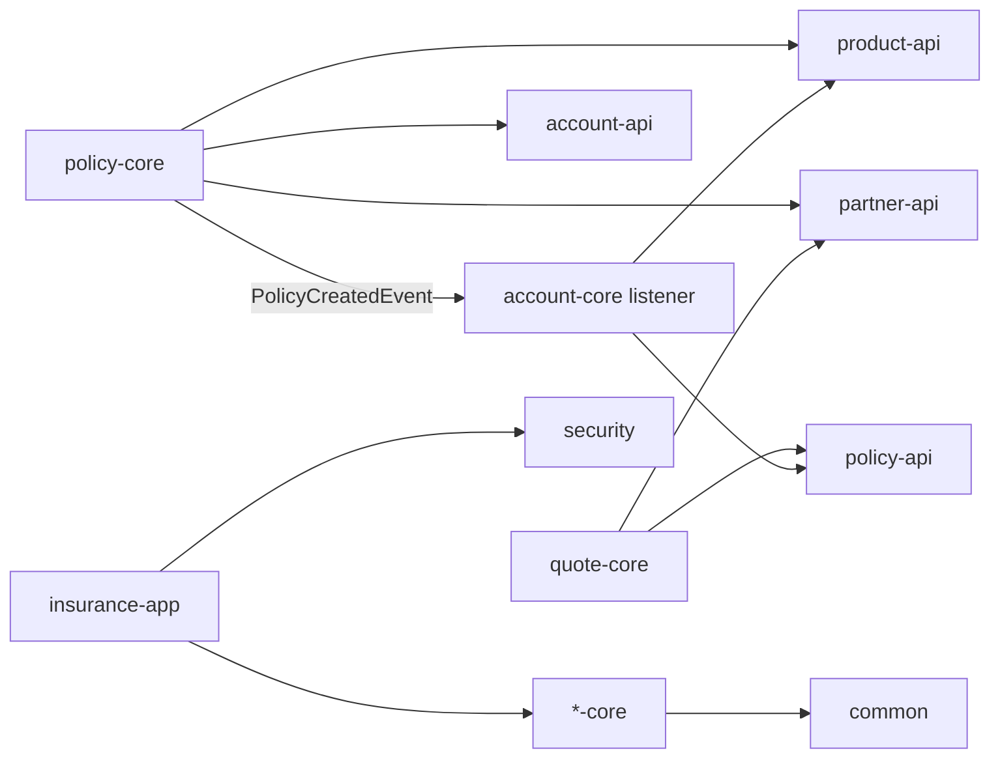

# Architektur-Review: Modulstruktur jmix-insurance

Stand: 2026-05-31. Analysiert wurden Composite-Build, Gradle-Abhaengigkeiten, Jmix-Konfigurationen, Starter, Entities, Services, Listener, Views, Liquibase und Tests.

## Kurzfazit

Die fachliche Grundidee ist gut erkennbar: `insurance-app` ist die Shell, Fachdomänen liegen in eigenen Add-ons, und die meisten Domänen sind in `*-api`, `*-core` und `*-starter` getrennt. Das ist fuer Jmix grundsätzlich ein tragfaehiges Modularisierungsmuster.

Der aktuelle Stand ist aber eher ein modularisierter Monolith als eine sauber entkoppelte Modularchitektur. Die Modulgrenzen werden auf Build-Ebene stark aufgeweicht, API-Module ziehen Jmix UI/Data-Infrastruktur mit, Core-Module exportieren ihre Abhaengigkeiten zu breit ueber `api`, und einige Dateien deuten auf Copy/Paste-Drift zwischen Modulen hin. Die dringendste Arbeit ist daher nicht, neue Module einzufuehren, sondern die bestehenden Grenzen konsequent zu schaerfen.

## Aktuelle Modulstruktur

Root-Projekt:

- `settings.gradle` bindet die Teilprojekte per `includeBuild` als Gradle Composite ein.
- Jedes Add-on ist wiederum ein eigener Gradle-Build mit zwei Subprojekten: fachliches Modul und Starter.
- `insurance-app` konsumiert die Starter-Artefakte und startet die Jmix-Anwendung.

Fachliche Module:

- `common`: gemeinsame Basisklassen und gemeinsame Value-/Utility-Typen.
- `security`: User-Entity, User-Views, UserRepository und FullAccessRole.
- `partner-api` / `partner-core`: Partner-DTOs und Servicevertrag / Partner-Persistence, UI und Service.
- `product-api` / `product-core`: Produkt-Enums/-Katalog in API, derzeit fast kein Core-Verhalten.
- `quote-api` / `quote-core`: Quote-DTOs und Servicevertrag / Quote-Entity, UI und QuoteService.
- `policy-api` / `policy-core`: Policy-DTOs, Event und Servicevertrag / Policy-Entity, UI und PolicyService.
- `account-api` / `account-core`: Account-DTO und Servicevertrag / Account-Entity, UI, Listener und AccountService.

Grobe fachliche Flussrichtung:

## Positive Befunde

- Die Domänenschnitte `partner`, `product`, `quote`, `policy`, `account`, `security` sind fachlich nachvollziehbar.
- Das API/Core/Starter-Muster ist grundsätzlich sinnvoll: andere Module koennen gegen Service-Interfaces und DTOs arbeiten, waehrend die Implementierung in Core bleibt.
- Cross-Modul-Kommunikation nutzt meistens Services und DTOs statt direkt fremde Entities zu laden. Beispiele: `quote-core` ruft `PolicyService`, `policy-core` publiziert `PolicyCreatedEvent`, `account-core` konsumiert `PolicyService`.
- Persistente Fachobjekte und UI liegen weitgehend in den `*-core`-Modulen statt in der Shell-App.
- Dezentrale Liquibase-Changelogs pro Modul sind angelegt und im App-Master-Changelog eingebunden.
- Es gibt bereits App-Integrationstests fuer zentrale End-to-End-Flows: Quote akzeptieren, Policy erzeugen, Account erzeugen.

## Wichtigste Risiken

### 1. API-Module sind technisch zu schwergewichtig

Die `*-api`-Module enthalten zwar meist nur DTOs, Enums und Service-Interfaces, haengen aber buildseitig an:

- `io.jmix.core:jmix-core-starter`
- `io.jmix.data:jmix-eclipselink-starter`
- `io.jmix.flowui:jmix-flowui-starter`
- `io.jmix.flowui:jmix-flowui-themes`

Ausserdem deklarieren die API-Konfigurationen `@JmixModule(dependsOn = {EclipselinkConfiguration.class, FlowuiConfiguration.class})` und registrieren ViewControllers/Actions fuer API-Packages, obwohl dort keine Views liegen.

Auswirkung: Ein eigentlich leichter Vertrag wird zu einem Jmix-UI/Data-Modul. Das erschwert Wiederverwendung, Tests, Abhaengigkeitsanalyse und spaetere Auslagerung.

Empfehlung:

- API-Module auf das Minimum reduzieren: DTO-Metadaten, Enums, Service-Interfaces, Events.
- Wenn DTOs bewusst Jmix DTO-Entities sind, reicht typischerweise Jmix Core-Metadatenunterstuetzung; Flow UI und Eclipselink sollten nicht pauschal im API-Modul haengen.
- ViewController-/Action-Beans aus API-Konfigurationen entfernen, solange API-Module keine eigenen UI-Komponenten enthalten.

### 2. Core-Module exportieren Abhaengigkeiten zu breit

Viele Core-Gradle-Dateien verwenden `api` fuer andere Module, z.B.:

- `policy-core` exportiert `policy-api`, `partner-api`, `account-api`, `product-api`, `common`.
- `account-core` exportiert `account-api`, `policy-api`, `product-api`, `common`.
- `quote-core` exportiert `quote-api`, `partner-api`, `policy-api`, `common`.

Damit werden fremde APIs transitiv an alle Konsumenten weitergereicht. Das macht die effektive Architektur breiter als die fachliche Architektur.

Empfehlung:

- `api` nur fuer Typen verwenden, die wirklich Teil der oeffentlichen Binärschnittstelle eines Moduls sind.
- Die meisten Cross-Modul-Abhaengigkeiten in Core-Modulen auf `implementation` umstellen.
- `core-starter -> api project(':core')` kann bleiben; innerhalb des Core-Moduls sollte aber nicht alles transitiv exportiert werden.

### 3. `insurance-app` bindet Core- und API-Starter doppelt ein

`insurance-app/build.gradle` zieht pro Domäne meist beides:

- `account-core-starter` und `account-api-starter`
- `policy-core-starter` und `policy-api-starter`
- `quote-core-starter` und `quote-api-starter`
- `partner-core-starter` und `partner-api-starter`
- `product-core-starter` und `product-api-starter`

Da die Core-Module ihre API-Starter bereits einbinden, ist die explizite API-Einbindung in der App redundant. Sie macht schwerer sichtbar, welche Module wirklich direkt gebraucht werden.

Empfehlung:

- App nur an die benoetigten Feature-/Core-Starter haengen.
- API-Starter nur dann direkt in der App einbinden, wenn die App bewusst ohne Core-Implementierung gegen eine API laufen soll.

### 4. Architekturgrenze zwischen UI und Domäne ist noch unscharf

Core-Module enthalten Entities, Services, Listener und Flow-UI-Views gemeinsam. Das ist fuer Jmix-Add-ons nicht falsch, aber es erzeugt eine grosse "core"-Schublade. Auffaellig ist ausserdem, dass View-Controller fachliche Orchestrierung anstossen und teilweise UI-Text hart kodieren, z.B. `QuoteListView` mit `"Quote rejected"` und `"Policy issued: ..."`.

Empfehlung:

- Innerhalb jedes Core-Moduls package-seitig staerker trennen: `entity`, `service`, `listener`, `view`, optional `mapper`, `event`.
- UI darf Services aufrufen, aber fachliche Entscheidungen sollten in Services bleiben.
- User-visible Text konsequent ueber Message Keys fuehren.

### 5. Copy/Paste-Drift in Produktmodulen

Im `product-core` liegen Ressourcen unter `view/partner`, die auf `com.insurance.partner.core.entity.Partner` und `partner_Partner` zeigen. Auch Testressourcen liegen unter `com/insurance/partner/core`. Im `product-api` liegen Tests im Package `com.insurance.partner.api` und importieren Partner-Konfigurationen.

Auswirkung: Das ist ein starkes Signal, dass Modul-Templates kopiert wurden und die Modulidentitaet nicht ueberall bereinigt ist. Das kann Tests falsch absichern, Jmix-Scanning verwirren und spaeter versehentlich Partner-Artefakte aus Produktmodulen laden.

Empfehlung:

- `product-api` und `product-core` komplett auf Partner-Namensreste pruefen.
- Falsche Partner-Views/Testressourcen entfernen oder korrekt als Product-Artefakte ausmodellieren.
- Einen einfachen Architekturtest ergaenzen: kein `product-*` darf `com.insurance.partner.core` referenzieren.

### 6. Security ist als Fachmodul ausgelagert, Rollenmodell aber sehr grob

Das neue `security`-Modul kapselt User-Entity, UserRepository, User-Views und `FullAccessRole`. Das ist als Infrastrukturmodul sinnvoll. Es gibt aber nur:

- `FullAccessRole` mit Wildcards fuer alles.
- `UiMinimalRole` in der App fuer Login/MainView.

Fachmodule liefern keine eigenen Rollen fuer ihre Entities, Views und Menues.

Auswirkung: Die Module sind fachlich getrennt, aber nicht sicherheitlich autonom. Neue Module bringen keine klaren Zugriffsregeln mit.

Empfehlung:

- Pro fachlichem Modul mindestens eine ResourceRole definieren, z.B. `partner-read`, `partner-manage`, `quote-manage`.
- Rollen in dem Modul halten, das auch Entity/View/Menu besitzt.
- Wildcard-FullAccess nur fuer System/Admin-Testzwecke verwenden.

### 7. Modul-Tests sind zu oft nur Context-Smoke-Tests

Die einzelnen API/Core-Module haben viele `contextLoads()`-Tests. Die wirklich aussagekraeftigen fachlichen Tests liegen vor allem in `insurance-app`. Das prueft End-to-End-Flows, laesst aber Modulgrenzen selbst relativ ungeschuetzt.

Empfehlung:

- Je Core-Modul gezielte Service-Tests halten, die nur das Modul plus benoetigte API-Mocks starten.
- App-Integrationstests fuer Cross-Modul-Flows behalten.
- Architekturtests ergaenzen, z.B. mit ArchUnit oder einfachen Gradle/RG-basierten Checks:
  - API-Module duerfen keine Core-Packages importieren.
  - Core-Module duerfen fremde Core-Module nicht direkt importieren.
  - Produktmodule duerfen keine Partner-Packages referenzieren.
  - API-Module duerfen keine Flow-UI-Views enthalten.

### 8. Event-Kopplung ist synchron und transaktional unklar

`PolicyServiceCore.createPolicy()` speichert eine Policy und publiziert danach `PolicyCreatedEvent`. `account-core` hoert darauf und erzeugt ein Account. Da ein normales Spring-Event verwendet wird, laeuft der Listener synchron im selben Prozess; die genaue Transaktionssemantik sollte bewusst entschieden werden.

Auswirkung: Ein Fehler im Account-Modul kann je nach Transaktionskontext Policy-Erzeugung beeinflussen oder zu halb erwarteten Zustaenden fuehren. Aktuell loggt der Listener einige Fehler und bricht still ab.

Empfehlung:

- Fachlich entscheiden: Muss Account-Erzeugung atomar mit Policy-Erzeugung sein?
- Falls ja: synchroner Service-Orchestrator oder explizit dokumentierte Transaction Boundary.
- Falls nein: `@TransactionalEventListener(phase = AFTER_COMMIT)` plus klare Fehlerbehandlung/Retry-Konzept.
- Event-Payload moeglichst vollstaendig halten, damit Account nicht direkt wieder `PolicyService.findPolicyById()` aufrufen muss.

### 9. Datenmodell koppelt Domänen ueber String-IDs und Business-Keys

Beispiele:

- `Account.policyId` ist ein `String`, obwohl es eine Policy-ID repraesentiert.
- `Account.accountNo` entspricht faktisch `Policy.policyNo`.
- Quote speichert `createdPolicyId` und `createdPolicyNo` als Strings.
- Partner-Verweise laufen ueber `partnerNo`.

Das kann als bewusste Modulgrenze sinnvoll sein, weil keine fremden Entities referenziert werden. Es braucht dann aber klare Konventionen und Constraints.

Empfehlung:

- Pro Referenz bewusst entscheiden: technische UUID als String/UUID, fachlicher Key oder echte JPA-Relation.
- Felder entsprechend benennen: z.B. `policyId` als `UUID` oder `String policyExternalId`; `accountNo` nicht gleichzeitig als PolicyNo missbrauchen, wenn es fachlich ein eigenes Konto ist.
- Unique-Constraints fuer Business-Keys pruefen.

### 10. Build-Konfiguration ist stark dupliziert

Fast jedes Add-on wiederholt dieselben Blöcke fuer Jmix Plugin, Repositories, Publishing, JavaCompile, Hilla-Excludes und Test-Konfiguration.

Auswirkung: Aenderungen an Jmix-Version, Publishing oder Testverhalten muessen mehrfach nachgezogen werden. Das erhoeht Drift-Risiko.

Empfehlung:

- Convention Plugin oder gemeinsame Gradle-Skriptlogik einfuehren, z.B. `build-logic` oder `gradle/jmix-addon-conventions.gradle`.
- Jmix-Version und gemeinsame Dependency-Versionen zentralisieren.
- Publishing-Credentials nicht mit Default `admin/admin` im Buildfile fuehren.

## Zielbild

Ein robustes Zielbild waere:

```mermaid
flowchart TB
    App["insurance-app"] --> SecurityStarter["security-starter"]
    App --> PartnerCoreStarter["partner-core-starter"]
    App --> ProductCoreStarter["product-core-starter"]
    App --> QuoteCoreStarter["quote-core-starter"]
    App --> PolicyCoreStarter["policy-core-starter"]
    App --> AccountCoreStarter["account-core-starter"]

    QuoteCore["quote-core"] --> QuoteApi["quote-api"]
    QuoteCore --> PartnerApi["partner-api"]
    QuoteCore --> PolicyApi["policy-api"]
    QuoteCore --> ProductApi["product-api"]

    PolicyCore["policy-core"] --> PolicyApi["policy-api"]
    PolicyCore --> PartnerApi
    PolicyCore --> ProductApi

    AccountCore["account-core"] --> AccountApi["account-api"]
    AccountCore --> PolicyApi
    AccountCore --> ProductApi

    PartnerCore["partner-core"] --> PartnerApi
    ProductCore["product-core"] --> ProductApi

    PartnerCore --> Common["common"]
    PolicyCore --> Common
    QuoteCore --> Common
    AccountCore --> Common
    Security["security"] --> Common
```

Kernprinzipien:

- API-Module sind leicht und enthalten keine UI/Persistence-Implementierung.
- Core-Module implementieren die API und besitzen Entity, Service, Listener, UI und Liquibase ihrer Domäne.
- Fremde Core-Module werden nicht direkt importiert.
- App setzt Module zusammen, enthaelt aber moeglichst wenig Fachlogik.
- Starter aktivieren genau ein Modul und dessen benoetigte Konfiguration.

## Konkrete naechste Schritte

1. Product-Module bereinigen: alle Partner-Artefakte aus `product-api` und `product-core` entfernen oder korrekt umbenennen.
2. `insurance-app/build.gradle` vereinfachen: direkte `*-api-starter`-Dependencies entfernen, soweit Core-Starter sie bereits bringen.
3. API-Module verschlanken: FlowUI/Eclipselink-Abhaengigkeiten und ViewController/Actions-Konfiguration pruefen und entfernen, wo ungenutzt.
4. Gradle `api` vs. `implementation` auditieren und transitive Exporte reduzieren.
5. Pro Fachmodul ResourceRoles ergaenzen.
6. Synchronous Event-Flow Policy -> Account bewusst festlegen und dokumentieren.
7. Architekturtests fuer Import-Regeln einfuehren.
8. Gemeinsame Gradle-Conventions einfuehren, um Drift bei Add-on-Builds zu stoppen.

## Priorisierte Findings

| Prioritaet | Thema | Risiko | Empfehlung |
| --- | --- | --- | --- |
| Hoch | Product-Module enthalten Partner-Artefakte | Falsche Scans, falsche Tests, unklare Modulidentitaet | Sofort bereinigen |
| Hoch | API-Module ziehen UI/Data-Starter | Schwere APIs, schlechte Entkopplung | API-Module verschlanken |
| Hoch | App bindet Core- und API-Starter doppelt | Unklare Komposition, redundante Konfiguration | App-Dependencies reduzieren |
| Mittel | Zu breites `api` in Gradle | Transitive Kopplung | `implementation` als Default |
| Mittel | Keine fachmodularen Rollen | Security nicht modular | Rollen pro Fachmodul |
| Mittel | Sync-Event Policy -> Account unklar | Fehler-/Transaktionsverhalten unklar | Transaction Boundary entscheiden |
| Mittel | Build-Duplikation | Drift bei Versionen/Konfiguration | Convention Plugin |
| Niedrig | Context-only Modul-Tests | Wenig Schutz fuer Modulgrenzen | Architektur- und Service-Tests |

## Offene Fragen

- Soll diese Struktur bewusst ein modularer Monolith bleiben, oder ist spaetere Auslagerung einzelner Domänen geplant?
- Sind API-Module auch fuer externe Clients gedacht, oder nur fuer interne Cross-Modul-Aufrufe?
- Soll die Account-Erzeugung fachlich zwingend Teil der Policy-Erzeugung sein?
- Soll `product-core` ueberhaupt existieren, solange der Produktkatalog rein enum-/regelbasiert im `product-api` liegt?

