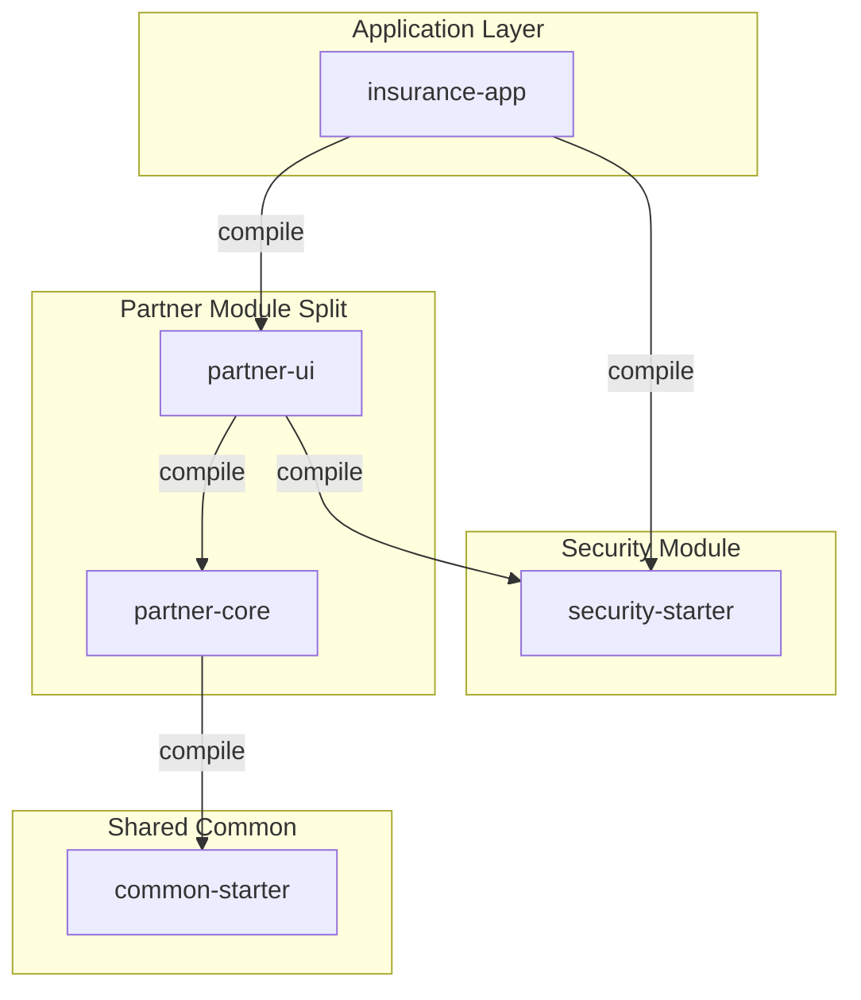

# Architectural Plan - Splitting Jmix Modules into Core and UI Layers

This document provides a comprehensive analysis and a step-by-step refactoring plan to split the current `*-core` modules into separate backend logic (`*-core`) and presentation logic (`*-ui`) modules. 

The goal is to cleanly decouple database entities, schemas, and business services from the Vaadin Flow UI framework, while allowing the new `*-ui` modules to directly consume JPA entities without going through the DTO-based `*-api` layer.

---

## 1. Architectural Analysis

Currently, each `*-core` module (e.g., `partner-core`) is a single Jmix module that contains JPA entities, Liquibase changelogs, Spring services, repositories, and Vaadin Flow UI views.

By splitting them, we introduce a strict layered architecture:



### Implications of the Split

| Aspect | `*-core` Module | `*-ui` Module |
| :--- | :--- | :--- |
| **Responsibilities** | JPA Entities, Spring Repositories, Core Services, Database Migrations (Liquibase), Entity Event Listeners | View Controllers (Java), View Descriptors (XML), Menu Definitions, UI Fragments, Translation Bundles (`messages.properties`) |
| **Jmix Starters** | `jmix-core-starter`, `jmix-eclipselink-starter` (No UI dependencies) | `jmix-flowui-starter`, `jmix-flowui-themes` |
| **Dependencies** | Depends on `common-starter` | Depends on its local `*-core` and Jmix Flow UI |
| **Transitive Impact** | Clean backend library. Can be imported by headless microservices or CLI tools without Vaadin classpaths. | Standard Jmix UI module. Automatically pulls in core entities transitively. |

> [!NOTE]
> Since `*-ui` has a direct dependency on `*-core`, it has full access to the database entities (`@Entity`). Jmix DataGrid and data containers (`collection`, `instance`) in UI XML descriptors will continue to reference the JPA entities directly.

---

## 2. Refactoring Step-by-Step (Using `partner` as Model)

To split the module `partner` as a prototype, the following steps must be taken:

### Step 2.1: Initialize the `partner-ui` Gradle Project
1. In the `partner-core` composite directory, create a new subproject directory `partner-ui`.
2. Add `include 'partner-ui'` in `partner-core/settings.gradle`.
3. Create `partner-core/partner-ui/partner-ui.gradle` with Jmix Flow UI dependencies:
   ```gradle
   archivesBaseName = 'partner-ui'
   dependencies {
       api project(':partner-core')
       implementation 'io.jmix.flowui:jmix-flowui-starter'
       implementation 'io.jmix.flowui:jmix-flowui-themes'
   }
   ```

### Step 2.2: Relocate Code & Resources
1. **Views**: Move `PartnerListView.java` and `PartnerDetailView.java` from `partner-core` to `partner-ui` under `com.insurance.partner.ui.view.partner`.
2. **Descriptors**: Move `partner-list-view.xml` and `partner-detail-view.xml` from resources in `partner-core` to `partner-ui`.
3. **Menu & Messages**: Move `menu.xml` and user-facing `messages.properties` into `partner-ui` at `/com/insurance/partner/ui/`.
4. **Module Properties**: Create `module.properties` inside `partner-ui` and define menu layout registration:
   ```properties
   jmix.ui.menu-config=com/insurance/partner/ui/menu.xml
   ```

### Step 2.3: Configure Jmix Module Classes
Split the single configuration class into two distinct Jmix module configurations:

#### In `partner-core` (`PartnerConfiguration.java`):
```java
package com.insurance.partner.core;

import io.jmix.core.annotation.JmixModule;
import io.jmix.eclipselink.EclipselinkConfiguration;
import org.springframework.context.annotation.*;
import com.insurance.common.CommonConfiguration;

@Configuration
@ComponentScan
@JmixModule(dependsOn = {
        CommonConfiguration.class,
        EclipselinkConfiguration.class
})
@PropertySource(name = "com.insurance.partner.core", value = "classpath:/com/insurance/partner/core/module.properties")
public class PartnerConfiguration {
    // Retains DTOs or core beans. No ViewControllers or Actions beans.
}
```

#### In `partner-ui` (`PartnerUiConfiguration.java`):
```java
package com.insurance.partner.ui;

import io.jmix.core.annotation.JmixModule;
import io.jmix.flowui.FlowuiConfiguration;
import io.jmix.flowui.sys.ActionsConfiguration;
import io.jmix.flowui.sys.ViewControllersConfiguration;
import io.jmix.core.impl.scanning.AnnotationScanMetadataReaderFactory;
import org.springframework.context.ApplicationContext;
import org.springframework.context.annotation.*;
import java.util.Collections;

@Configuration
@ComponentScan
@JmixModule(dependsOn = {
        PartnerConfiguration.class,
        FlowuiConfiguration.class
})
@PropertySource(name = "com.insurance.partner.ui", value = "classpath:/com/insurance/partner/ui/module.properties")
public class PartnerUiConfiguration {

    @Bean("partner_PartnerUiViewControllers")
    public ViewControllersConfiguration screens(final ApplicationContext applicationContext,
                                                final AnnotationScanMetadataReaderFactory metadataReaderFactory) {
        final ViewControllersConfiguration viewControllers
                = new ViewControllersConfiguration(applicationContext, metadataReaderFactory);
        viewControllers.setBasePackages(Collections.singletonList("com.insurance.partner.ui"));
        return viewControllers;
    }

    @Bean("partner_PartnerUiActions")
    public ActionsConfiguration actions(final ApplicationContext applicationContext,
                                        final AnnotationScanMetadataReaderFactory metadataReaderFactory) {
        final ActionsConfiguration actions
                = new ActionsConfiguration(applicationContext, metadataReaderFactory);
        actions.setBasePackages(Collections.singletonList("com.insurance.partner.ui"));
        return actions;
    }
}
```

### Step 2.4: Clean Up `partner-core`
1. Remove Jmix Flow UI starters from `partner-core/partner-core/partner-core.gradle`.
2. Delete UI view package folders, descriptor resources, and menu registration inside `partner-core`.

---

## 3. Impact on Integration Tests

Domain modules often run tests using security layers (`com.insurance.security:security-starter`). Because Jmix security views or users might be loaded, we need to ensure that test scopes remain aligned.

1. **Gradle Test Dependency**:
   In `partner-core/partner-core/partner-core.gradle`, we will no longer need `jmix-flowui-starter` at compile-time. However, backend tests might still load standard spring test configs.
2. **Split Test Configurations**:
   - Backend tests (e.g. testing service logic) will run against `PartnerTestConfiguration.java` which only imports `PartnerConfiguration.class`.
   - UI tests (if any) will execute in the context of the `partner-ui` subproject, loading `PartnerUiConfiguration.class`.

---

## 4. Summary of Benefits & Trade-offs

> [!TIP]
> **Advantages:**
> - **Exposing clean APIs:** If another project (or an API gateway) wants to pull in `partner` domain services or entities, it can depend purely on `partner-core` without loading Vaadin Web assets or starting Vaadin engines.
> - **Faster builds:** UI and resources compilation are completely segregated.
> - **Cleaner separation of concerns:** Prevents engineers from placing UI-centric logic (e.g. dialogs, notifications) inside Spring services.

> [!WARNING]
> **Trade-offs / Overhead:**
> - **Double Module Configuration**: Every new component requires updating settings across two subprojects (`settings.gradle`, configurations, dependency coordinate resolution).
> - **Menu XML aggregation**: If composite Jmix modules are split, `insurance-app`'s master `menu.xml` or properties must explicitly map navigation entry targets correctly to prevent path resolution failures.
